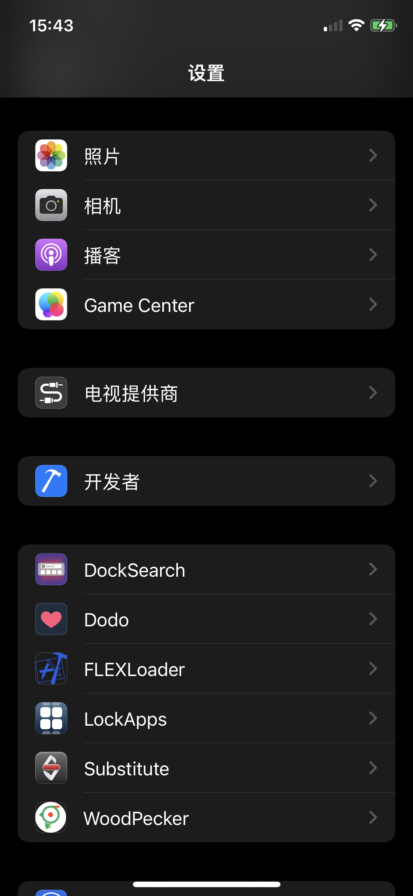
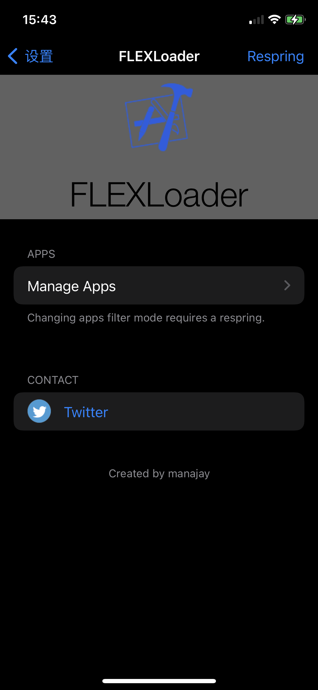
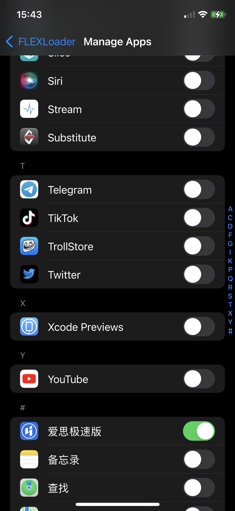

# FLEX Loader Tweak

FLEXLoader 可以在越狱设备上动态加载 libFLEX.dylib 到任意应用中，以使用 FLEX 进行应用内调试。

关于 FLEX 可以参考[它的项目主页](https://github.com/Flipboard/FLEX.git)。

原始插件文章 可以参考[我的这篇博客](http://swiftyper.com/2017/06/04/inspect-third-party-app-using-flexloader/)。

## 安装

FLEXLoader 已经提交 Cydia, 可查看 [todayios-cydia](https://todayios-cydia.github.io/cydia/depictions/?p=com.todayios-cydia.flexloader)

## 安装
- 配置好本地的 thoes 环境 详情查看 [theos-installation-macos](https://theos.dev/docs/installation-macos)
  - 注意配置好环境变量 `${THEOS}` 以及 对应的 iPhone SDK 是否在 theos 的 SDK 文件夹中
- 将本项目 clone 到本地，修改 Makefile 中的设备 IP 和 PORT，然后执行 `make package install` 即可。
  - 如果想自动安装到手机
  - 配置好 ssh 
  - USB 连接越狱设备: `iproxy 2222 22`
  - 到 `make do`
  - 然后 生成 deb 文件, 就可以安装到 iOS 设备上

## 使用

打开设置页, 找到 FLEXLoader Manage Apps, 选择要你想要调试的程序, 打开开关。

启动对应的应用，就可以在应用中看到调试窗口了。

