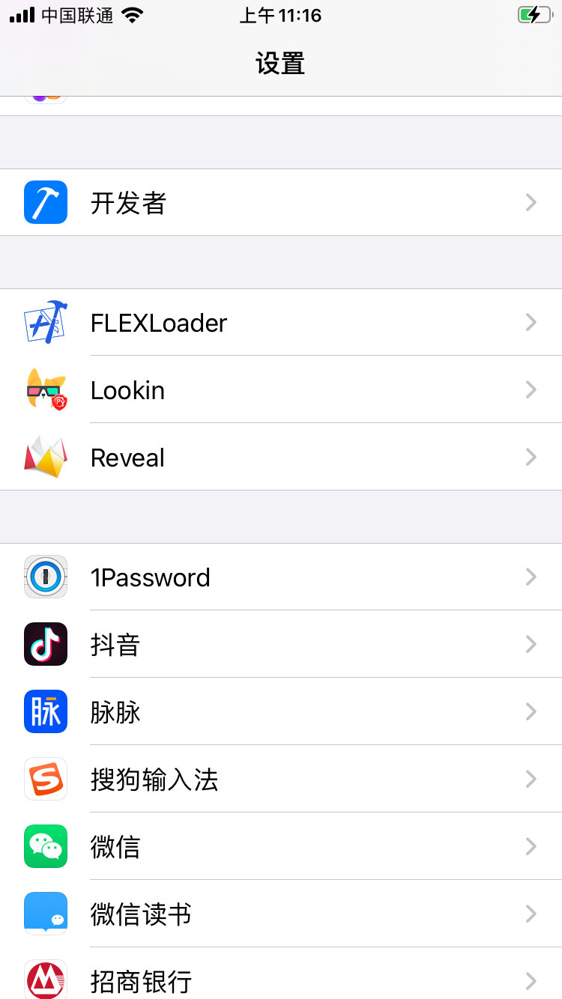

# FLEX iOS Jailbreak Tweak

FLEXLoader 可以在越狱设备上动态加载 libFLEX.dylib 到任意应用中，以使用 FLEX 进行应用内调试。

关于 FLEX 可以参考[它的项目主页](https://github.com/Flipboard/FLEX)。

当前 FLEX动态库的 版本是 4.2.2

感谢作者: 关于本项目更详细的内容，可以参考[我的这篇博客](http://swiftyper.com/2017/06/04/inspect-third-party-app-using-flexloader/)。

## 安装

FLEXLoader 已经提交 Cydia 市场审核，审核通过后可以直接从 Cydia 中进行下载安装。

### 手动安装

将本项目 clone 到本地，修改 Makefile 中的设备 IP 和 PORT，然后执行 `make package install` 即可。
其他注意
1. thoes 本地的安装路径
2. USB 连接越狱设备: iproxy
3. 具体功能是先生成 dylib动态库, 再加上 plist 配置, 生成 deb 文件, 然后安装到 iOS 设备上
4. 注意动态库签名问题

### 签名问题

```
Load libFLEX dylib fail: dlopen(/Library/Application Support/FLEXLoader/libFLEX.dylib, 2): no suitable image found.  Did find:
	/Library/Application Support/FLEXLoader/libFLEX.dylib: code signature in (/Library/Application Support/FLEXLoader/libFLEX.dylib) not valid for use in process using Library Validation: mapped file has no cdhash, completely unsigned? Code has to be at least ad-hoc signed.
```

原因是动态库签名有问题,  `build_dylib.sh` 执行过程中, 没有给生成的动态库签名或者签名不对 , 之下下面的签名命令 (ps 注意替换成自己的证书)

```
codesign -fs "Apple Development: ljduan2013@icloud.com (992QNX5ZG6)" ./layout/Library/Application\ Support/FLEXLoader/libFLEX.dylib
```

经测试 出现如下替换签名样式的话, 插件可以正常在真机上加载

```
./layout/Library/Application Support/FLEXLoader/libFLEX.dylib: replacing existing signature
```

## 使用

在系统设置界面中找到 FLEXLoader，选择要你想要调试的程序打开开关。

启动对应的应用，就可以在应用中看到调试窗口了。

## 效果




## 公众号

如果你对本项目有兴趣，可以关注我的公众号。


